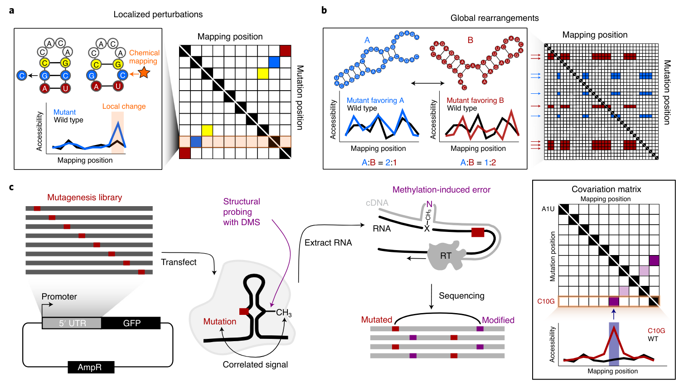

# icm2 data processing pipeline and analysis codes

**icm2** (in-cell mutate-and-map) is a method to characterize RNA structure inside cells. The experiment generates two-dimensional accessibility mapping data under cellular conditions. This code demonstrates how such data can be used to model RNA secondary structure ensembles. The input here is the .fastq files from Illumina sequencing run for an icm2 experiment. Outputs are a set of visualizations of the data and a set of secondary structures and their weights fitted by REEFFIT. The repository accompanies https://doi.org/10.1038/s41588-021-00830-1 and reproduces the analysis presented in the paper.

The mutation counts matrix code has been updated with Julia version (11/07/2021)



## Dependencies

Utilities 
```
cutdapt
bowtie2
bbmap
samtools
viennarna
```

Python packages
```
rdatkit
reeffit
```

Julia packages
```
ArgParse
ColorSchemes
DataFrames
DelimitedFiles
Gadfly
StatsBase
XAM
```

R packages
```
data.table
cowplot
tidyverse
scales
Biostrings
edgeR
limma
hues
viridis
impute
ggrepel
```

* Python packages rdatkit and reeffit should be installed and properly set up so that they can be called in the working environment. (see https://github.com/ribokit/RDATKit and https://github.com/ribokit/REEFFIT)

* Same goes for ViennaRNA package. Its standalone programs should be set up to be called from the environment.

### Usage

1. Pre-process and align the sequencing reads (p0.sh)
2. Make correlated mutation counts matrix (m2matrix.jl)
3. Data visualization; clustering; output constraints (icm2.R)
4. Ensemble model fits (reeffit\_bootstrap\_run.sh)

* bonus\_combined.dot is the set of 500 suboptimals sampled by RNAsubopt used as input to REEFFIT exactly for the paper.

* The parameters within each script were used to produce the analysis presented in the paper. The index are available under index/reference\*. The raw sequencing data can be downloaded from GEO under accession code GSE155656.

## Reference

```bibtex
@article{https://doi.org/10.1038/s41588-021-00830-1,
  title={Functional and structural basis of extreme conservation in vertebrate 5' untranslated regions},
  author={Gun Woo Byeon, Elif Sarinay Cenik, Lihua Jiang, Hua Tang, Rhiju Das, Maria Barna},
  journal={Nature Genetics},
  year={2021}
}
```
